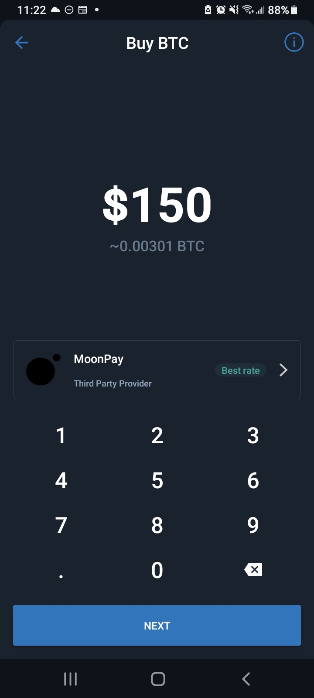

# 🤌💸 Buy Crypto

Coinbase and TrustWallet can both sell you Bitcoin, Ethereum, and other cryptos.

> Coinbase on Desktop view, as a user buys Bitcoin

 

> Opting to buy Bitcoin via Moonpay in the TrustWallet app

It's entirely possible *(they have a checkbox, as you check out)* to set up an auto-buy with Coinbase. If you set up a weekly buy, you can stop worrying about DCAing (trying to buy intelligently) because you've decided to make your crypto investing automatic.

Another good reason to slowly amass crypto is that you *may* face a hold period before you can send your Bitcoin or whatever else you bought. This is a sad fact of life with all known crypto exchanges in 2021, even Coinbase.

PS: The first step is to [join Coinbase.
](https://www.coinbase.com/join/jacks_pv)
