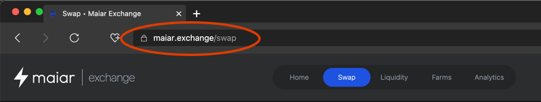
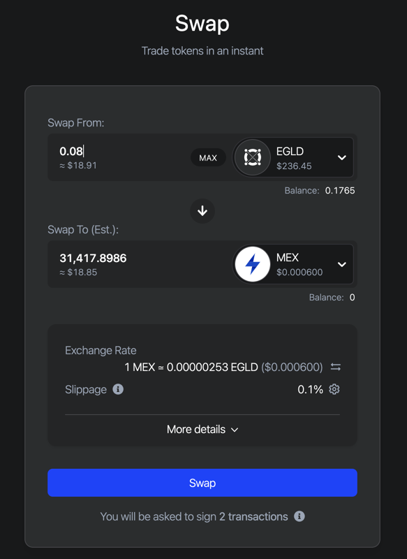
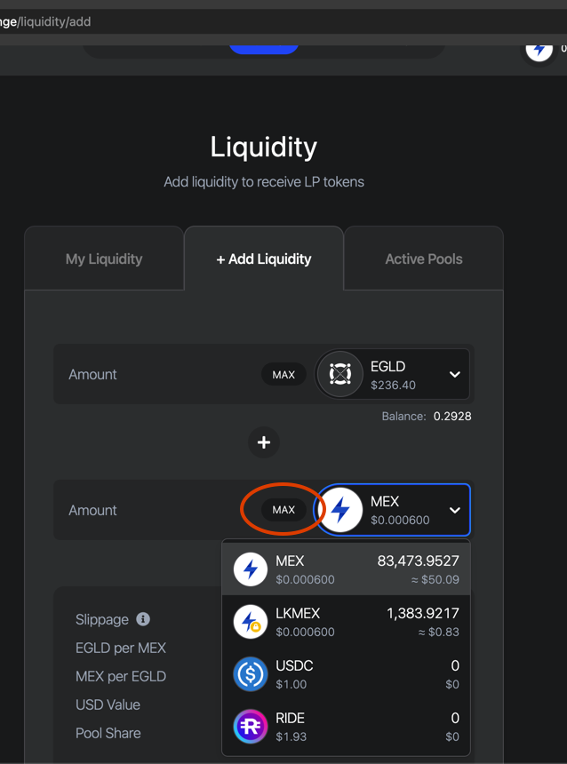
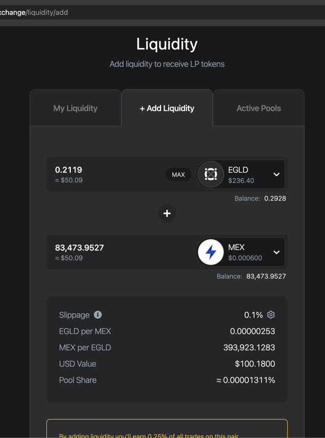
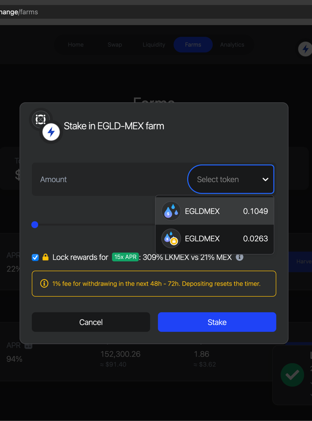
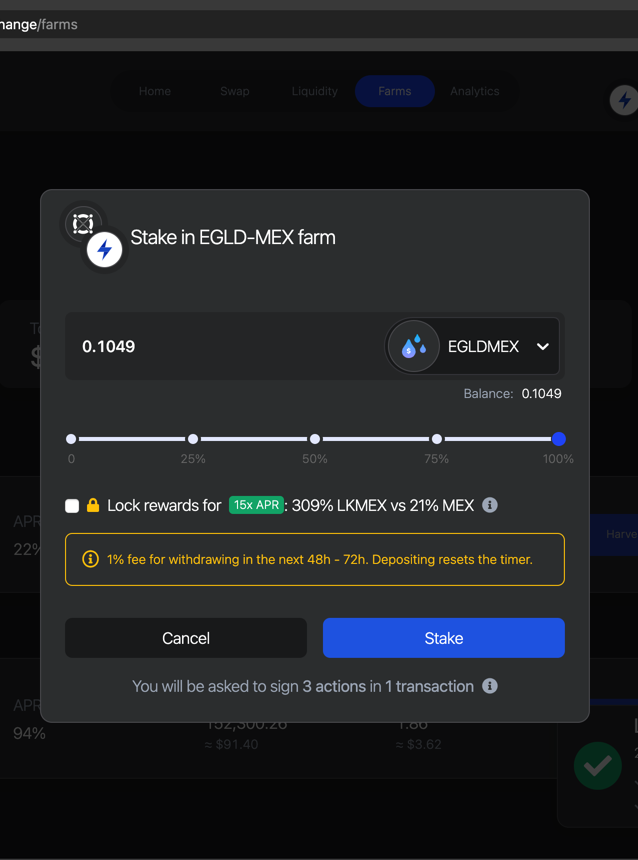
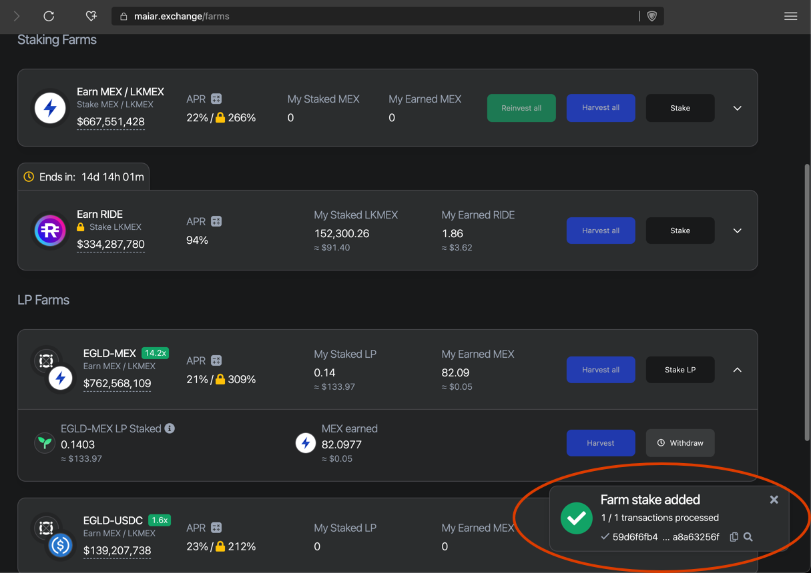

# Ⓜ️🚜 MEX Farming on Maiardex

OK, I promised a step-by-step guide to farm MEX tokens with EGLD. Here we go!
If you haven't already, the first step is to [join Maiar.](https://www.coinbase.com/join/jacks_pv)

### 🎬 Confirm Connection & Go To /Swap

Ensure you see the expected URL, and that it's a Secure connection.
Now navigate to the Swap page on Maiar so you
can trade EGLD for MEX.

### 1. Get MEX from EGLD
Use just under half of your EGLD, at max.

### 2. Go To /Liquidity/Add
Choose the MEX you just made to pair with your EGLD. You can use the MAX button to select it all.

### 3. Assemble LP Tokens

The EGLD and MEX will become LP (Liquidity Pool) tokens as they match in value. See why you only swapped about half the EGLD in Step 1? The amount of LP tokens you get just reflects your ratio of the TVL in the entire pool.

:::tip
The gold message box explains that you are now earning 0.25% whenever the EGLD-MEX pair is traded on Maiardex. Cool as heck, right? But let's keep going and farm the LPs you just staked for bonus rewards.
:::tip

> EGLD-MEX LP Tokens Created! Now click on green Stake button or the Farms option up top.

### 4. Choose the LPs you just Made
You're about to plant some LP seeds in the soil of Maiardex! You can choose to lock your rewards and create LKMEX, not MEX; Locked MEX cannot be traded for months, so the choice of farm is a strategic decision for you to ponder carefully.

> You can see how 2 different LPs are possible: EGLD-MEX & EGLD-LKMEX (the tiny yellow lock is not very easy to see, sadly, and the app doesn't make it clear that the 2nd tokens are EGLD-LKMEX in any other way.)

### 5. Farm your new LPs
Will you choose to farm MEX, or Lock/freeze your MEX rewards into LKMEX, for a huge bonus??

> Press Stake button. Sign the transactions with Maiar app on your phone....

### 🏁 Admire EGLD-MEX Farm

Congrats! Now you can just sit and watch your MEX grow!!! *You have earned the title of DeFi MEX Farmer.* 🙀Ⓜ️🚜 

Withdraw your profits when you're ready and stake them anew, or use them to make more EGLD!

> Stay tuned for more DeFi and Maiar content!

