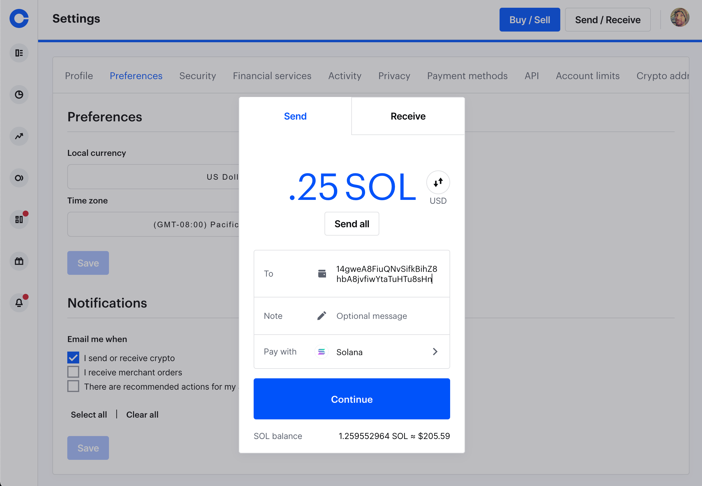

# 📬💸 Send Crypto

Two parties can easily exchange most cryptos. The original crypto, Bitcoin, is a good first one to learn how to send, so let's do that.

1. The sender needs the receiver's (recipient's) address, and that's really all there is to it. You act as both parties when you send yourself money from wallet to exchange, exchange to wallet, wallet to app, and etc, etc.

2. Here's an example BTC address, feel free to show us some appreciation 💌: _19WqGUVaYr2U5SwWw7hta8Ezx6VRT8VBZF_
 

> Sending Solana on Coinbase (Desktop view)

It's not that different from mailing a letter, but it's much faster. Speed-wise, the metaphor of texting money versus mailing it seems more apt, but your Solana _(pictured),_ Bitcoin, Ether, Algorand, and etc addresses are all meant to be public, like your mailing address.

:::tip
Quick reminder: the receiving addresses are public, the Twelve Words that unlock your wallet are only for you.
:::tip

PS: The first step is to [join Coinbase.
](https://www.coinbase.com/join/jacks_pv)
