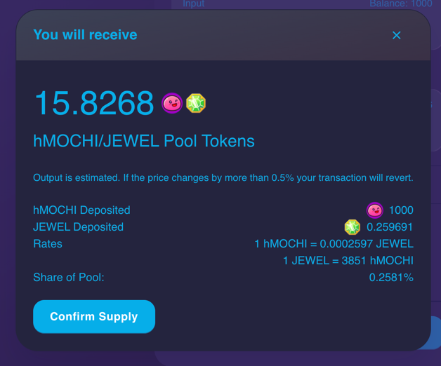
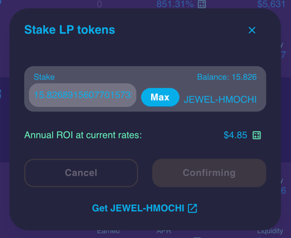

# 🏗🏯 Stake Crypto

>  when you hold LPs, you're part of the DEX's financial system

## What Staking Means

Staking is when you hold your funds in place, and some smart contract gives you rewards as thanks. This is the exact thing that happens with investment tools like mutual funds, but we're using automatic blockchain tech now. Because people love staking money into portfolio items that work like this and simply generate *passive yields*, and because blockchain smart contracts make it easy to code financial tools, crypto in 2021 is blooming into a large new industry calling itself Decentralised Finance (DeFi).

## How To Stake

When you own CELO (or ALGO, or ATOM) you receive rewards directly into your wallet every few weeks, as people and apps use these blockchains. Yet it's not just these cryptos that make up DeFi. Most blockchains allow for smart contracts, so most blockchains have DeFi tools now. The example below is from HarmonyONE, a stupendous Ethereum clone that is 1000x cheaper to use.

Staking (aka locking up funds) is called "providing liquidity" and is a cool technique for making money with money that anyone can learn. Only Step 1 is required, but Step 2 is highly suggested.

### 1. Providing (Adding) Liquidity & Pools

Gluing two crypto tokens together creates a public investment tool called a *Liquidity Pool token*. Do this at the *Trade > Liquidity* section of any DEX such as [Uniswap](https://app.uniswap.org/#/swap), [Pancakeswap](https://pancakeswap.finance/liquidity), [Mochiswap](https://harmony.mochiswap.io/liquidity), [SpookySwap](https://spookyswap.finance/add). Those are 4 different decentralised exchanges (DEXs), one per blockchain (Ethereum, Binance, Harmony, Fantom, respectively) yet if you compare them you can see how their layouts and UX are all very similar because the feature of providing liquidity is the same regardless of crypto.

:::caution
1000 + 0.26 ≄ 15.82

Notice the amounts of hMOCHI and JEWEL used are very different. Also, they create a weird number of LP tokens that regardless equal the value of both the ingredients.
:::caution

These LP tokens require gas fees to make and unmake, yet they will slowly grow to reward you like ATOM or ALGO whenever users interact with your pair (whenever someone trades crypto #1 for crypto #2). So when you hold LPs, you're part of the DEX's financial system! The larger your percent of the liquidity pair, the larger your reward. You're helping anonymous crypto fans just like yourself move value back and forth between crypto tokens.

If you want multiple rewards you can *also* stake these funds into Farms or Vaults or Pools, similar tools that will also multiply the LP investment and often reward you with a second token as well.

### 2. Stake LP Tokens into a Pool, Farm, Vault, etc 
Once you stake your LPs into a Pool or Farm you start earning extra yield, because the Pool will pay you back in LP tokens and possibly another token, too! Secondary yield is part of the magic of DeFi.

This [Mochiswap](https://harmony.mochiswap.io/farms) farm offers two separate yields: both more JEWEL-HMOCHI tokens *and MOCHI tokens*. Double harvests from farming with Liquidity Pool tokens!

Huge varieties of LP combinations exist, representing decentralised/public versions of traditional currency lending pairs like US/EUR. The tremendous volume of crypto exchanges is made possible by continuous public investment into liquidity pairs.

> Popular financing and automated contracts is why the crypto markets never close.

As you can see, DeFi is brazenly built to disrupt the existing monetary system, and will continue to innovate relentlessly, 24/7 due to human nature. Underestimate this new industry at your own risk!

Interested in learning how to stake Egold and farm MEX on MaiarDex?? Please read on to find [this step-by-step guide](https://silversidedown.com/docs/basics/mex-farming).

:::tip
Add this site to your Homescreen and stay tuned for more upcoming DeFi content, such as:

- guide to playing the moonpot farm / lotto on Binance Smart Chain
- step-by-step guide on how to stake / farm using Binance Smart Chain on Pancakeswap
- NFT minting guide for Egold

These will stretch your imagination as well as your tech stamina, so prepare to earn the tasty APRs and APYs.
:::tip

> [ Have you joined Coinbase yet?](https://www.coinbase.com/join/jacks_pv) They currently offer 4% back on debit purchases, in crypto!

