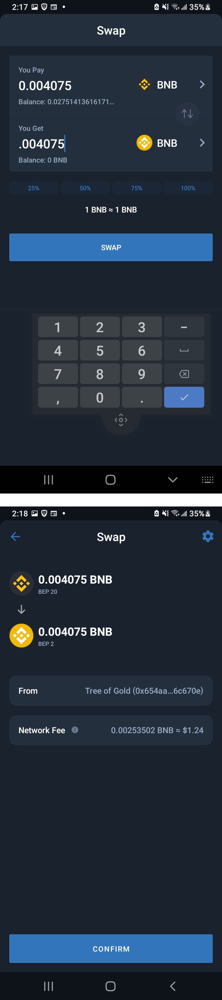

# 🔁🔄 Trade Crypto

When you exchange Bitcoin or Egold for another crypto, you're moving money across different blockchains. While it's basically just ownership records getting updated, interacting with blockchains requires you to use an app like Trust Wallet, a browser extension like MetaMask, or a central(ized) exchange like Maiar or Coinbase. There's a 4th option of using decentralized exchanges (DEXs) but let's skip that for now as it's the most complex yet chances are you'll understand it all by yourself after seeing these other, simpler ways.


## Trading Tokens (Swapping) with Trust Wallet

If you push the Swap button on the main screen you'll come to a choice of 2 options. This is the most basic way and direct way to exchange one crypto for another. 

Below you can see the choice to swap Binance Smart Chain token for Binance Chain token. The second screen shows how Trust Wallet is charging you a small gas fee for this swap.


:::tip
Bonus: If you're an adventurer on the Binance Smart Chain, you can use  [DungeonSwap](https://dungeonswap.finance) to acquire cool tokens like $POTS and $CAKE. Then you'll be set to enjoy [moonpot.com](https://moonpot.com) and [Pancakeswap.finance](https://Pancakeswap.finance)
:::tip

## 🔜 Trading w Meta Mask

## 🚧 Trading on Central Exchanges

We suggest you join the Maiar Exchange because Egold is a faster version of Bitcoin, the Maiar Dex is expanding to allow for investment tools (DeFi),  and last but not least the Maiar Wallet and Browser are both very secure apps. So this project looks like a good one to invest some time Doing Your Own Research and perhaps you'll agree and join the Maiar community and acquire some Egold someday.


Here's their address, plus my referral code (tyvm): [```https://maiar.exchange```](https://get.maiar.com/referral/o6q0in3yh6)


Another fine choice, offering many more cryptos than newcomer Maiar is [Coinbase](https://www.coinbase.com/join/jacks_pv). Coinbase is listed on the NASDAQ and their business model centers around exchanging cryptos for one another. They will also reward you if you use their debit card, so they're worth it even if you become a diehard fan of Maiar and the Maiardex.
