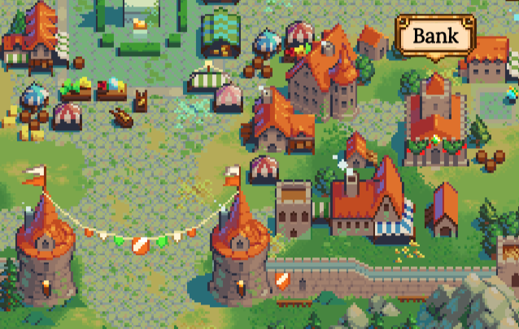
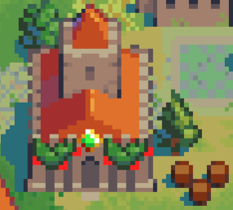
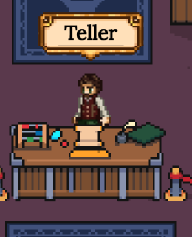
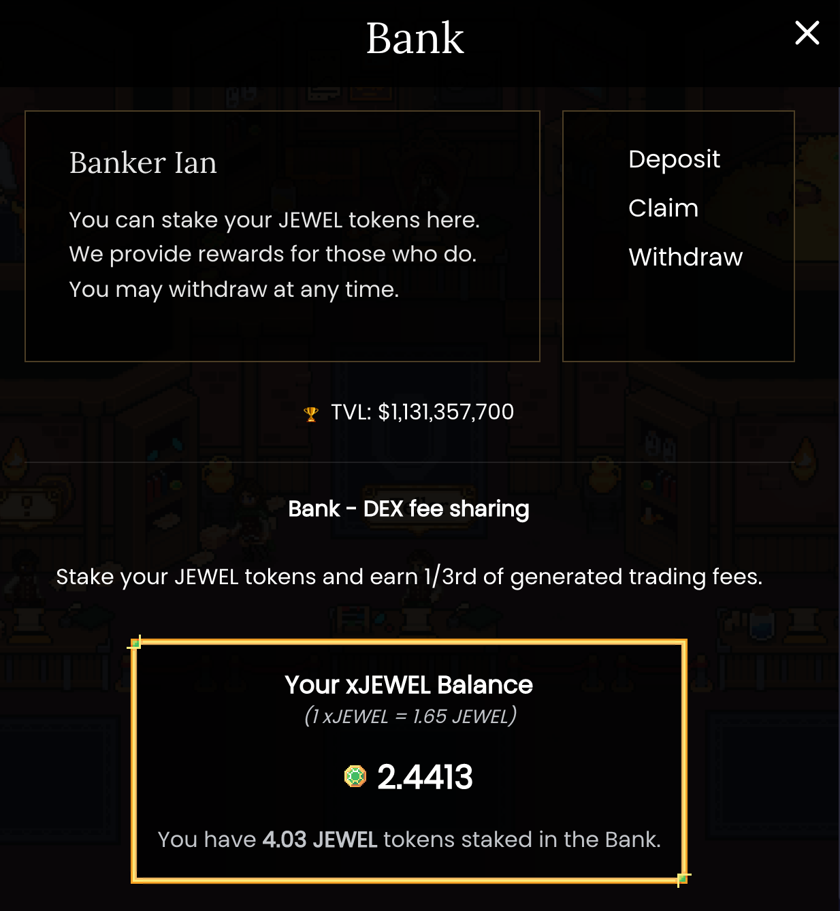
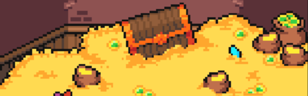

# 🔮🏦 DeFi Kingdoms Bank

### Tl;dr: So they cloned #Ethereum to make it 1000x cheaper & built a farming RPG inside of it DO YOU WANT TO SEE THE BANK

This is real, anon. A bank in a game can still earn you huge yields.  🙀🕹🎩💰 #DeFi powers the game called #DeFiKingdoms on the #HarmonyONE #blockchain.

Farming RPGs are known for their depth of economy so of course there is a Bank you can visit. It's near the gates of the city, right of center on the World Map.

The tiny Bank is definitely sporting a $JEWEL sign.

Go there. Interact with the Teller NPC (Ian) and you'll receive the chance to invest your JEWEL tokens.

Ian has a racket going where he exchanges JEWEL into xJEWEL... which then magically grows over time. APR LFG, especially when you consider the potential value of JEWEL.

That's it, anon. Check bank in a few days' time and keep good notes on your #DeFiant journey, because you're in a new world now!

[ Join Maiardex](https://www.coinbase.com/join/jacks_pv)

> Stay tuned for more DeFi and bonus round crypto content!

