# ⛷📊 Impermanent Loss

### 🤔 Yes, It Will Happen To You
Once the DeFi bug has bitten you, your curiosity will begin to rapidly max out and you'll soon find yourself researching odd new tokens and investment tools. The enthusiasm and enchantment factor that comes from making money in magic blockchain farms is powerful!

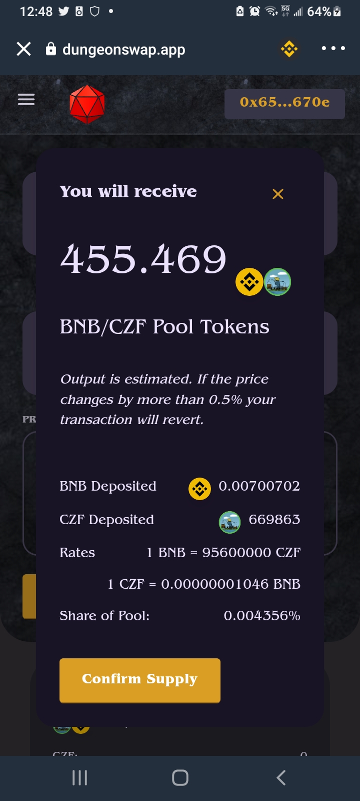
> 🚨 Don't get lost chasing down heavenly things, especially when you find them in dungeons

Even if you're not a risk-prone DeFi explorer who ventures into dungeons, Impermanent Loss can still happen to you. WHEN not IF, but WHEN you fail to take careful notes on your farming, you'll fall into a fun but confusing place where you won't be sure how much value a farm is generating...

:::tip
"Impermanent Loss" means the temporary loss of value in a pair of tokens.
:::tip

And even with solid notes and a clear head, you may somehow not notice that a pet investment is more vampire bat than hunting dog. Who knows how many factors come into play...

> The MochiSwap logo ｡◕ ‿ ◕｡

Let's walk through the steps of a recent farm optimising.

### 1. Confirm You're Losing Value
Does one of your LP tokens suck value from the other? Have you checked your notes and historical prices and are you ready to restake and fix things for the better?

Here's my record of investing some JEWEL/HMOCHI tokens I staked in a dual-yield farm about 2 weeks ago. 

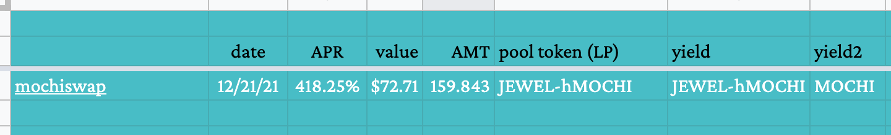

When I check the farm to see how many LPs I've earned in 12 days, I'm surprised to see that it's ZERO.

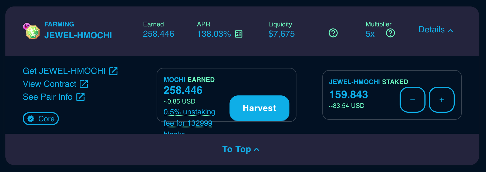

:::caution
This is weird, because a dual-yield farm should do 2 things:
1. make my LPs grow
2. create another token
:::caution

That I'm only seeing one of these is a bummer. Yet hold on, I made 258 MOCHI, that's almost 1% of the value of my LPs, in only 12 days-- that's not bad, right??

:::caution
But wait, what happened to the price of JEWEL the last twelve days?
:::caution

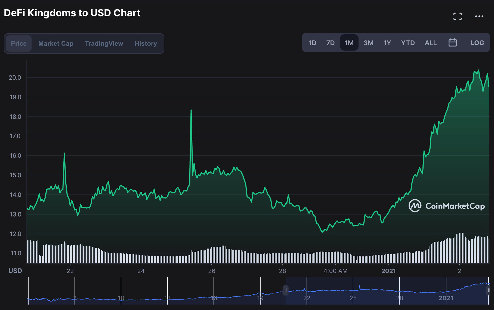

Aye caramaba, looks like I shot myself in the neck with some Impermanent Loss on this JEWEL LP. 🙀 The tokens would have gone from ~$13 to ~$19 (almost +50%!!) in value if they were pure JEWEL and not paired with HMOCHI!! (Yes, the CMC chart is also confused about what year it is, you are not alone.)

### 2. Unstake Farm
OK, time for action. Let's re-allocate these tokens in a more lucrative fashion!

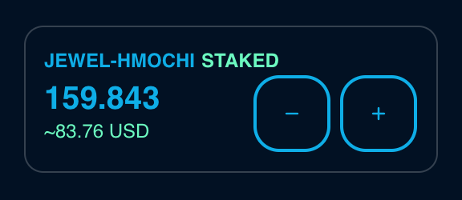

> Minus button those busted LP farms, fren. Any extra yield (for me, the 258 MOCHI) will also fall into your wallet during this step.

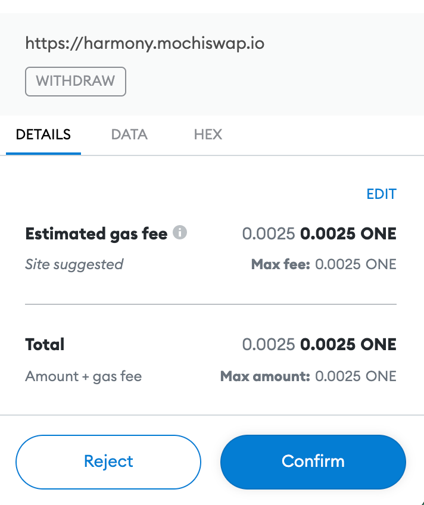

> Doesn't HarmonyONE blockchain have the cheapest gas??? 😻

If you're kinda unsure if your farm might be worthwhile in a few months, then just unstake 90% of it for this step. Feel free to leave 10% as "What If I'm Too Cautious Today" insurance policy. *But if you're certain this was a poor investment, unstake 100% of the LPs*. Cut your losses! I'm definitely scooping out all of these LPs, because this is one of the most disappointing farms I've yet created.

### 3. Remove your Liquidity Pair (goodbye LPs)

Turn your LPs back into two different piles of tokens. When I do this to my JEWEL-HMOCHI farm, the value comes out as half HMOCHI. This is the Impermanent Loss, because *the HMOCHI is adjusted to match the gains that JEWEL made*, SO I get less JEWEL back than I wanted-- exactly half of the current LP value, which has been depressed badly by the lazy HMOCHI.

:::tip
If "Teamwork Makes the Dream Work",

Impermanent Loss =

"the Dream Team you thought was hard at work was unemployed all this time"
:::tip

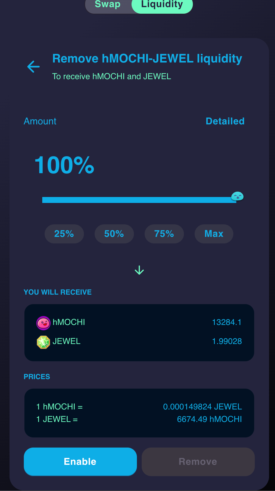

> Enable the remove liquidity process...

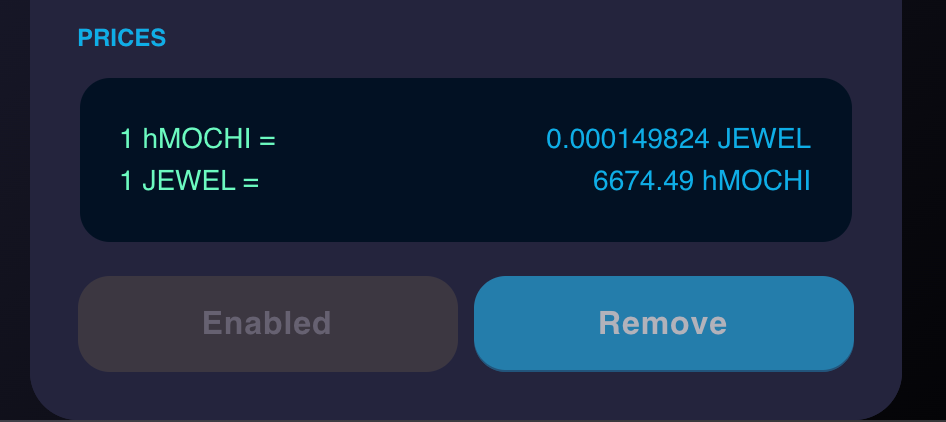

> Remove button is unlocked...

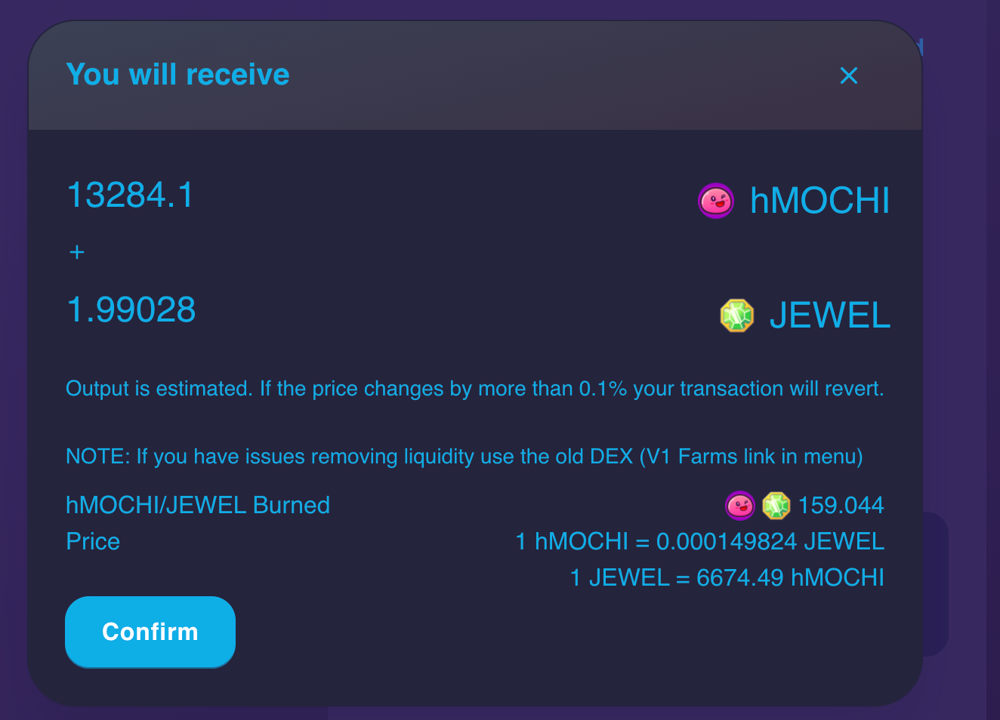

> Recover your tokens!

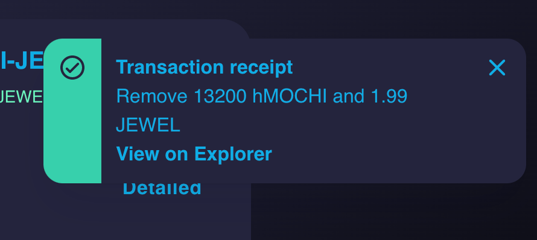

Congrats to me, this particular LP misadventure is at an end. Huzzah! Now the JEWEL can grow big and strong, unfettered by meme token weeds.

### 4. Swap Loser Tokens into Winners

But I'm still holding a lot of HMOCHI, which is flatly unacceptable given my research today.

So I'm gonna swap the DEX's goofy meme token back into the one with actual use (ergo, value), JEWEL. If you haven't looked into what JEWEL is and how it powers the DeFiKingdoms game, I recommend that you do!

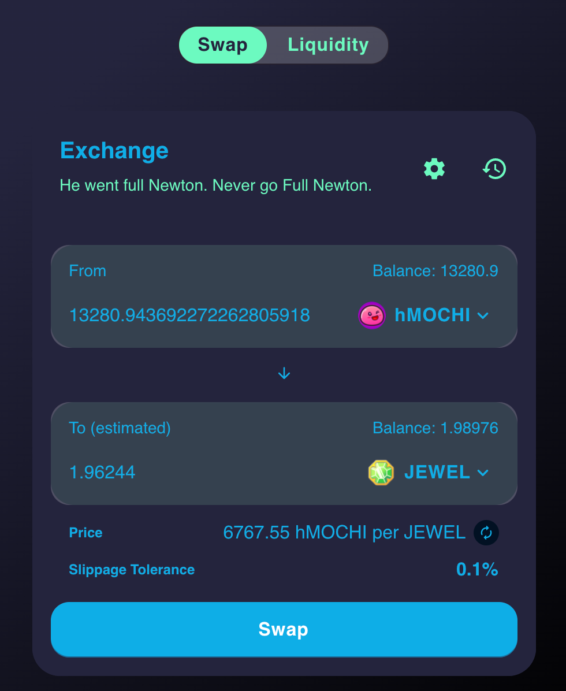

> Notice how the DEX is mocking me with a rando text snippet for going "Full Newton". Whatever, mochiswap, I'm secure in my madcap financieering. 😤

Once the swap is complete, I can confirm that MetaMask only shows a balance of JEWEL, and no more hMOCHI.

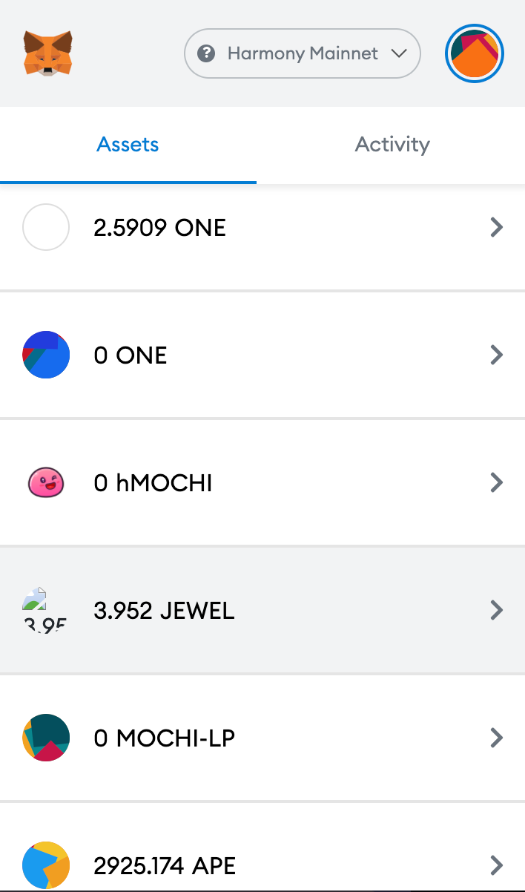

### 🏁 Final Thoughts on LP games & DeFi Farms/Pools/Etc

If It's Too Good To Be True, IT IS. Nobody is giving away money today. Believe you me.

I *would* have made money these last few days *IF I only held JEWEL*, but I locked it into a liquidity pair with HMOCHI, which anchored it from soaring in value. It was Impermanent Loss to my LP, but I took the hit and unstaked today (cutting my losses) b/c I've no confidence in HMOCHI going forward-- but I believe in JEWEL based on the past few days.

That's about 200 days of DeFi experience points rolled into one batch for you, anon. Hope you level, it's a lot of xp!

:::warning
DYOR & Take Your Own Notes (TYON)
:::warning

The quicker you collect data, the quicker you can fine tune your farms! Be safe and sane out there, and don't stay down any one rabbit hole too long! 

### 🎼 Coda

After hundreds of hours of research, the best place I've found to safely farm crypto is [MaiarDex](https://www.coinbase.com/join/jacks_pv). Their exchange token MEX is strengthened by a slow unlock mechanic (Locked MEX) that sets them apart from other AMM platforms. Game theory PhDs were involved, no joke-- the Maiar project seems like it has answers to many of the troubles I've seen in the DEX/DeFi space last year.

Guides forthcoming, of course.

[ Join Maiardex](https://www.coinbase.com/join/jacks_pv)

> Stay tuned for more DeFi and bonus round crypto content!

