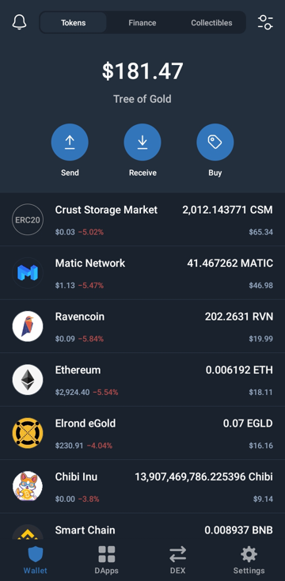
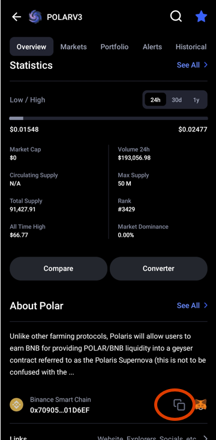
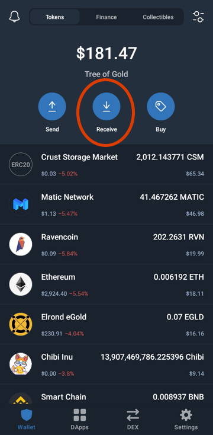
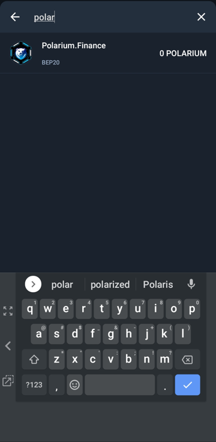
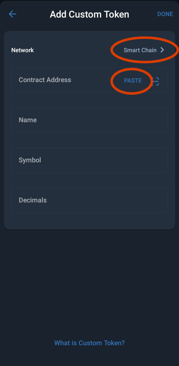
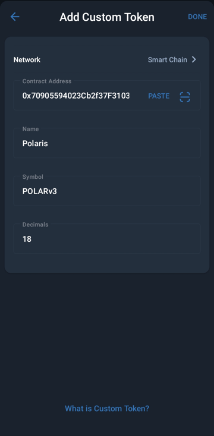
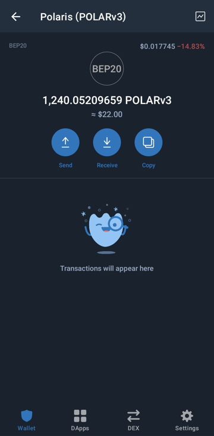
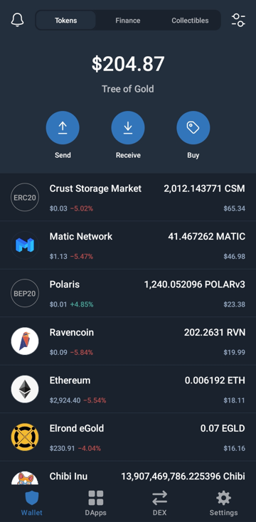

# Add Tokens to Wallet

## 🔍 How to Add a New Token to [Trust Wallet](https://trustwallet.com/deeplink/) 

### 1. Where are the new tokens I just swapped for?
Here's a common misadventure you'll encounter soon enough (once you start swapping at Dexes). Let's say I just swapped some BNB for a new token called Polaris but it's not showing up in my Wallet... I can tell because the balance is too low!

### 2. Research Contract
I need to head over to [CoinMarketCap.com](https://coinmarketcap.com/currencies/polaris-share/) to look up the Polaris token *contract address*. The Copy symbol will auto-copy it to my clipboard.

### 3. Receive, Add when search fails
Then I'll click *Receive* button up top in Trust Wallet.

I'll search for 'Polaris' and when it doesn't show up, I choose *Add Custom Token*

### 4. Add token contract
Then I can just Paste in the contract address that's copied. (Had to choose Smart Chain from the Network, first.)

The token metadata fills in automatically!

### 5. Refresh, tokens show up
After a *Swipe down to refresh* in Trust Wallet, I can now see the Polaris tokens show up!

### 6. Checking wallet balance vs the first screen, looks good again!

## 🏁 Tokens were always in the wallet; they just weren't showing up

:::tip
If you ever can't find a new crypto you've acquired, check [CoinMarketCap](https://coinmarketcap.com/) or [CoinGecko](https://www.coingecko.com) for thousands of contract addresses to unlock these tokens in your Trust Wallet or MetaMask.
:::tip
