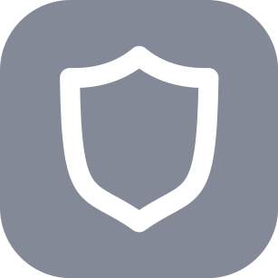
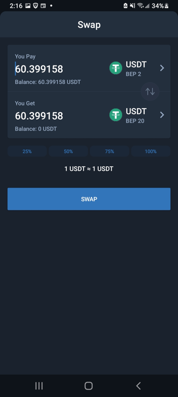

# Even with Coinbase & Valora, You Still Need a Wallet

[Trust Wallet](https://trustwallet.com/deeplink/) is the best option for just about everyone.  A mobile app that can hold any crypto from any blockchain, there's no reason for beginners to look elsewhere. Unless...

> Are you already using the Brave Browser? If so, you can unlock its built-in crypto wallets and use it to store your currency. And let's get pitchy for a moment here-- Brave is super useful if you prefer working on a laptop versus a phone. If this sounds like you, look into Brave Browser because it has other cool features like ad blocking, too! So ok, if you're a Brave user, open Brave Settings and you'll find a Wallet option on the left sidebar; this can accept ETH (Ethereuem), BTC (Bitcoin), BAT (Basic Attention Token) and many more currencies. Choose ETH & BAT for now, double check that you have your Brave account password saved securely, and then pat yourself on the back! 

#### The Brave Browser Wallet on desktop resolution

# Get MetaMask If
Brave's wallet is similar to a Chrome Browser extension called [MetaMask](https://en.wikipedia.org/wiki/MetaMask), which has really smoothed the way for crypto developers ever since 2017. When you run your browser you automatically have access to crypto: it's like having your wallet attached to Chrome and makes visiting Web 3.0 sites a breeze.

It interacts with most major blockchains, and will work better for you than TrustWallet if you dislike using phone apps to move money around.

Unfortunately it's painful for Ethereum users right now due to the age of the v1 network because transaction fees sometimes cost dozens of dollars, US. Yet this is true in TrustWallet, too-- they're both accessing the same blockchain, and there's no exchange to discount the transaction fees magically.

But it may be of special interest if:
- you really dislike using your smartphone for crypto stuff and prefer the web browser
- you plan to become a blockchain developer, because it gives you access to test networks
- you're wanting to play crypto games that use Ethereum tokens, like AxieInfinity

# Everyone Else, Download Trust Wallet
Let's avoid MetaMask for now and focus on [Trust Wallet](https://trustwallet.com/deeplink/)! Go ahead and download it to your phone now, and let's head to the next step. Here's an example screen of what Trust Wallet looks like on Android, while it swaps two very similar-looking tokens.

#### Typical Swap in Trust Wallet

## Now That You Have a Crypto Wallet...
:::tip
Did you write down your Twelve Words somewhere safe?
:::tip
