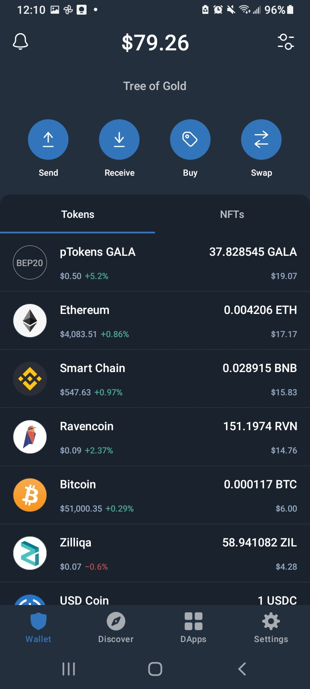
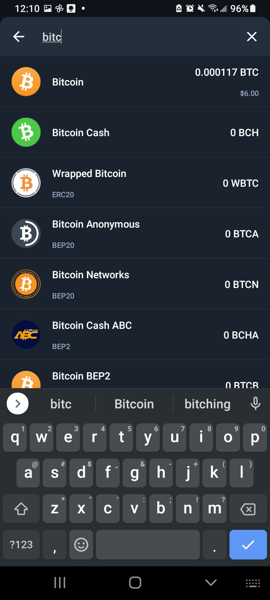
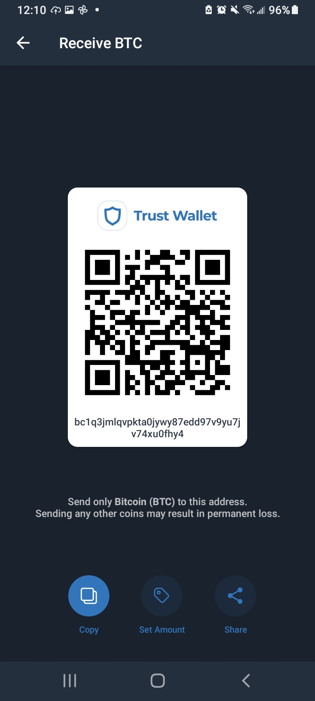

# You Need Your Own Wallet

Brand new to crypto? Did you click the new money symbol on your Twitter profile and feel some complex feelings?

Rejoice friend-- it's not tough to start receiving Bitcoin. Here are the essential steps you need to take.

## Overview:
1. download Trust Wallet
2. save your Key Words safely
3. generate BTC address
4. add the new address to Twitter

## download Trust Wallet

[Trust Wallet](https://trustwallet.com/deeplink/) is the best option for just about everyone.  A mobile app that can hold any crypto from any blockchain, there's no reason for beginners to look elsewhere. Unless you plan on getting into blockchain gaming, in which case you may need to use a more exotic wallet app like [Math Wallet](https://mathwallet.org/en-us/). Come back and grab Math if you need it, and just DL [Trust Wallet](https://trustwallet.com/deeplink/)! 

Below are example screens of what Trust Wallet looks like on Android. Apple devices will work similarly (YMMV).

## save your Key Words safely
When you first open Trust Wallet you will need to save some Key Words because this is how you can recover crypto. This can happen after you lose your phone and re-install Trust Wallet, so write them down and secure them somewhere.

:::tip
Did you write down & hide your wallet Key Words somewhere safe?
:::tip

## generate BTC address

What the app looks like on Android, with many tokens. Pretend that it's empty and that we need to add Bitcoin to our wallet.

> So press the Receive button...

> Search for and add Bitcoin to your Trust Wallet.

> Now use the Copy button to grab this text string, which is your Bitcoin receiving address.

## add the new address to Twitter
This is easy enough-- Edit your profile, Turn On Tips, and Add BTC Address.

### Edit your profile

### Turn On Tips

### Add BTC Address 

Just paste in the text you copied from Trust Wallet, and you're now ready to receive Bitcoin from your fans and fam!

