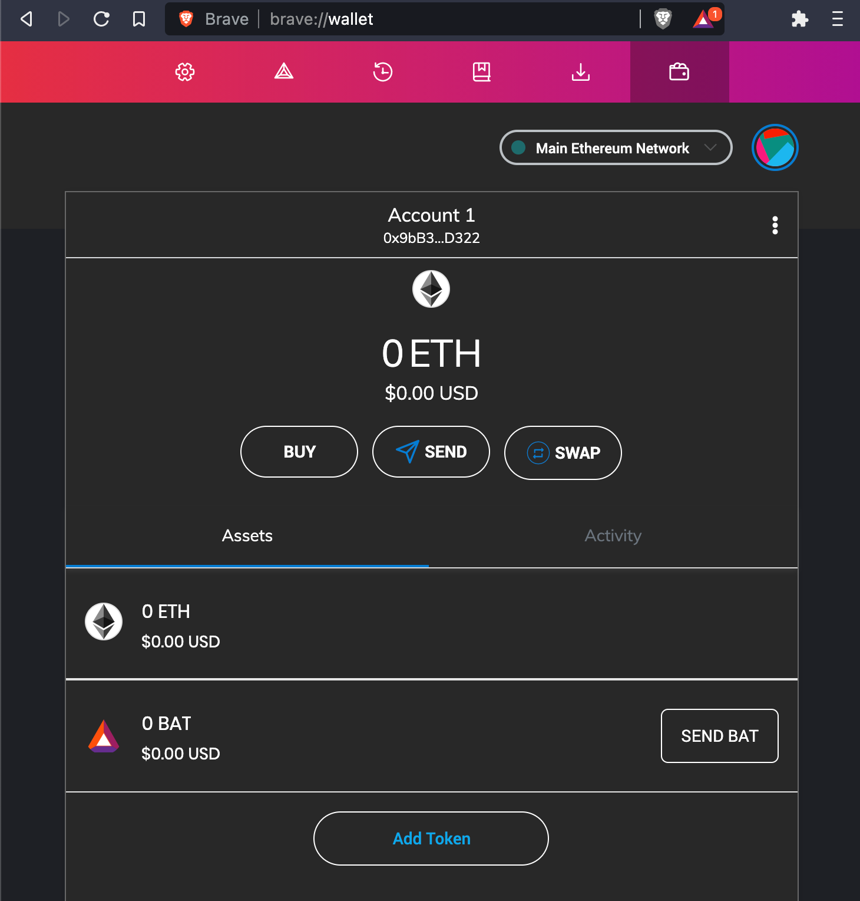

# Get a Crypto Wallet

[Trust Wallet](https://trustwallet.com/deeplink/) is the best option for just about everyone.  A mobile app that can hold any crypto from any blockchain, there's no reason for beginners to look elsewhere. Unless...

> Are you already using the Brave Browser? If so, you can unlock its built-in crypto wallets and use it to store your currency. Open Brave Settings and you'll find a Wallet option on the left sidebar; this can accept BAT, ETH, and many more currencies. Choose ETH & BAT for now, and pat yourself on the back!

Brave's wallet is similar to a Chrome Browser extension called [MetaMask](https://en.wikipedia.org/wiki/MetaMask).
MetaMask smoothed the way for crypto developers beginning in 2017. When you run your browser you automatically have access to crypto--  it's basically a wallet attached to Chrome. Unfortunately it's difficult to use now due to the age of the Ethereum v1 network, but it may be of special interest if you plan to become a blockchain developer, because it gives access to test networks: free-to-use clones of the Ethereum mainchain where you can build your Dapps.

So let's avoid MetaMask for now and focus on [Trust Wallet](https://trustwallet.com/deeplink/)! Go ahead and download it to your phone now, and let's head to the next step.
