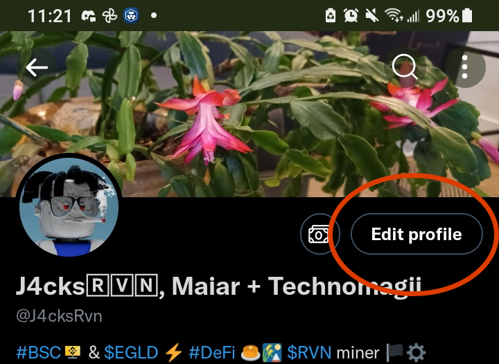
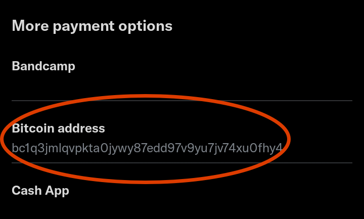

# You Need Your Own Wallet

*Brand new to crypto? Did you click the new money symbol on your Twitter profile and feel some complex feelings?*

Rejoice friend-- it's not tough to start receiving Bitcoin. Here are the essential steps you need to take.

## Overview:
1. Download Trust Wallet
2. Save your Key Words safely
3. Copy your Bitcoin (BTC) address
4. Paste the new address to Twitter

### Download Trust Wallet

[Trust Wallet](https://trustwallet.com/deeplink/) is a convenient place to stash Bitcoin. A mobile app that can hold most cryptos from most major blockchains, there's no reason for beginners to look elsewhere. *Unless you plan on getting into blockchain gaming, in which case you may need to use a more exotic wallet app like [Math Wallet](https://mathwallet.org/en-us/). Come back and grab Math if you need it, for now just DL [Trust Wallet](https://trustwallet.com/deeplink/)!*

Below are example screens of what Trust Wallet looks like on Android. Apple devices will work similarly (YMMV).

> Create a New Wallet for yourself. Good job! Do you have paper & pen ready? 📝

### Save your Key Words SAFELY
When you first open Trust Wallet app you will need to save some Key Words because this is how you can recover your crypto. Incredibly, this can happen even after you lose your phone and need re-install Trust Wallet! So write them down and store them somewhere safe *(not in the phone case)*.

:::caution
Did you write down & hide your wallet Key Words somewhere safe? No one can recover them for you, so take this seriously! 🛡
:::caution

### Copy your new BTC Address

Great work. Now you have several empty crypto accounts, like different pockets in the same wallet.

> Click the Bitcoin to see your address.

> Now press the Receive button...

> Finally, use the Copy button to grab this text string, which is your Bitcoin receiving address.

:::tip
This Copy button is popping up all over Web3 and it works just like *Ctrl + C* copy with keyboard so stay chill and carry on.
:::tip

### Paste your BTC Address to Twitter
This is easy enough-- Edit your profile, Turn On Tips, and Add BTC Address.

### 1. Edit your profile

### 2. Turn On Tips

### 3. Add BTC Address 

Just paste in the text you copied from Trust Wallet, and you're now ready to receive Bitcoin from your fans and fam!

Looking to convert that BTC into US Dollars and withdraw it at an ATM? Read elsewhere in this site about [joining Coinbase and Valora](https://silversidedown.com/docs/exchanges/join).

